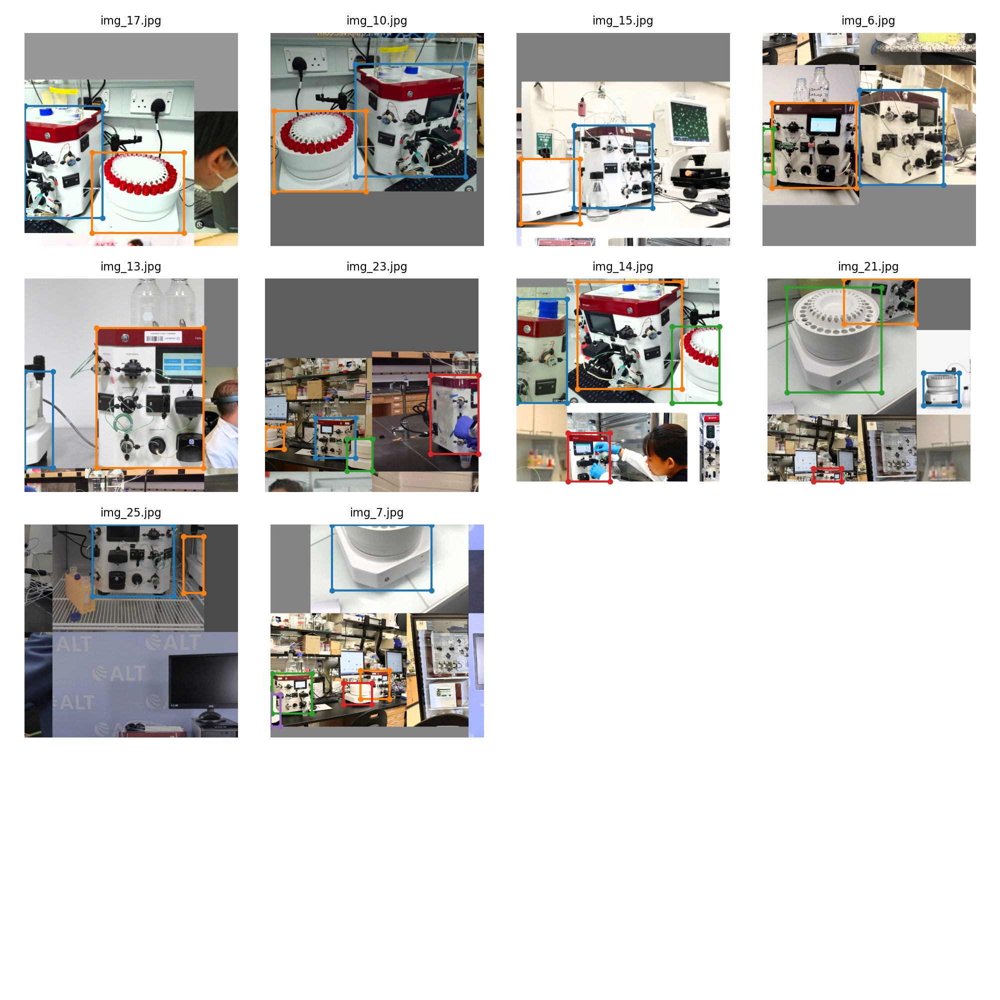
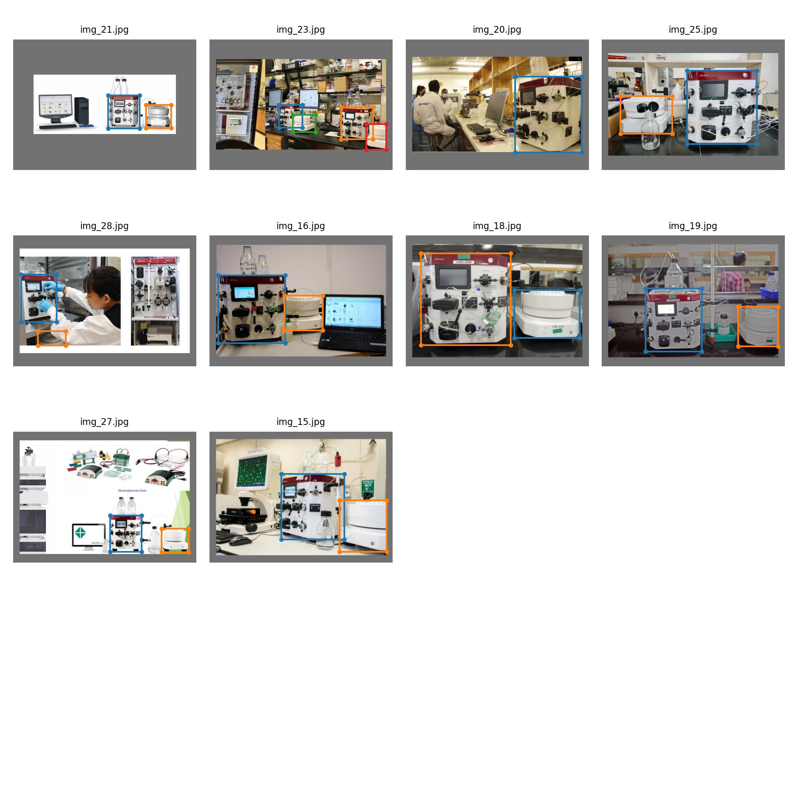

# assignment12-yoloV3
Yolov3 assignment 12 submission with Akta start images


# Steps followed 

## 1. Downloaded images and perform annotation

Downloaded Akta start protein purifier images from internet and annotated these with the help of tool.
Annotation generated the coordinates of objects. Two object we tried to identify. 
1. AktaStart instrument 
2. Sampler

Downloaded and annotated 30 image files. 

## 2. Update yolo code configuration for selected images set and classes

Used the repository [School of AI repo](https://github.com/theschoolofai/YoloV3) and downloaded the code
Updated following files 
1. Created yolov3-aktaStart.cfg. Updated details based on README instruction :
  - filters=21 ((4+1+2)*3)
  - classes=2
  Because I am lazy updated following as well
  - burn_in to 100
  - max_batches to 5000
  - steps to 4000,4500
2. Created folder ./data/aktaStart and following files
  - aktaStart.data
  - aktaStart.names
  - aktaStart.txt : 25 images.
  - aktaStartTest.txt : 15 images. 10 from training and 5 images are not seen during training.


3. Moved images and labels from annotation tools under /data/aktaStart folder
4. Downloaded existing model weights for training


## 3.0 Training 

> python train.py --data data/aktaStart/aktaStart.data --batch-size 10 --cache --cfg cfg/yolov3-aktaStart.cfg --epochs 30 --weights weights/yolov3-spp-ultralytics.pt

Executed for 30 epochs. It will generate following artifacts:
  - New models with name best.py and last.pt
  - train_batch0.png
  - result.png, results.txt, results.json
  - results.txt



## 3.0 Testing 

> python test.py --data data/aktaStart/aktaStart.data --batch-size 10  --cfg cfg/yolov3-aktaStart.cfg --weights weights/best.pt

Using trained model with name best.pt

I kept batch size 12 just for change. It generated the following output

  - test_batch0.png



## Execution logs

### Training logs:

Command given

> python train.py --data data/aktaStart/aktaStart.data --batch-size 10 --cache --cfg cfg/yolov3-aktaStart.cfg --epochs 30 --weights weights/yolov3-spp-ultralytics.pt

```Text

(pytorch) [ec2-user@ip-10-176-45-7 assignment12-yoloV3]$ python train.py --data data/aktaStart/aktaStart.data --batch-size 10 --cache --cfg cfg/yolov3-aktaStart.cfg --epochs 30 --weights weights/yolov3-spp-ultralytics.pt
Namespace(epochs=30, batch_size=10, accumulate=4, cfg='cfg/yolov3-aktaStart.cfg', data='data/aktaStart/aktaStart.data', multi_scale=False, img_size=[512], rect=False, resume=False, nosave=False, notest=False, evolve=False, bucket='', cache_images=True, weights='weights/yolov3-spp-ultralytics.pt', name='', device='', adam=False, single_cls=False)
Using CUDA device0 _CudaDeviceProperties(name='Tesla V100-SXM2-16GB', total_memory=16151MB)

Run 'tensorboard --logdir=runs' to view tensorboard at http://localhost:6006/
WARNING: smart bias initialization failure.
WARNING: smart bias initialization failure.
WARNING: smart bias initialization failure.
Model Summary: 225 layers, 6.25787e+07 parameters, 6.25787e+07 gradients
Caching labels (25 found, 0 missing, 0 empty, 0 duplicate, for 25 images): 100%|████████████████████████████████████████████████████████████████████████████████████████████████| 25/25 [00:00<00:00, 5443.75it/s]
Caching images (0.0GB): 100%|████████████████████████████████████████████████████████████████████████████████████████████████████████████████████████████████████████████████████| 25/25 [00:00<00:00, 130.23it/s]
Caching labels (16 found, 0 missing, 0 empty, 0 duplicate, for 16 images): 100%|████████████████████████████████████████████████████████████████████████████████████████████████| 16/16 [00:00<00:00, 5426.89it/s]
Caching images (0.0GB): 100%|█████████████████████████████████████████████████████████████████████████████████████████████████████████████████████████████████████████████████████| 16/16 [00:00<00:00, 92.56it/s]
Image sizes 512 - 512 train, 512 test
Using 8 dataloader workers
Starting training for 30 epochs...

     Epoch   gpu_mem      GIoU       obj       cls     total   targets  img_size
  0%|                                                                                                                                                                                       | 0/3 [00:00<?, ?it/s]/home/ec2-user/my/repo/github/assignment12-yoloV3/utils/utils.py:374: UserWarning: The torch.cuda.*DtypeTensor constructors are no longer recommended. It's best to use methods such as torch.tensor(data, dtype=*, device='cuda') to create tensors. (Triggered internally at /opt/conda/conda-bld/pytorch_1706743807255/work/torch/csrc/tensor/python_tensor.cpp:83.)
  lcls, lbox, lobj = ft([0]), ft([0]), ft([0])
/opt/conda/envs/pytorch/lib/python3.10/site-packages/torch/cuda/memory.py:440: FutureWarning: torch.cuda.memory_cached has been renamed to torch.cuda.memory_reserved
  warnings.warn(
      0/29     7.85G       6.1       136      1.61       144        14       512: 100%|█████████████████████████████████████████████████████████████████████████████████████████████| 3/3 [00:05<00:00,  1.75s/it]
/opt/conda/envs/pytorch/lib/python3.10/site-packages/torch/functional.py:507: UserWarning: torch.meshgrid: in an upcoming release, it will be required to pass the indexing argument. (Triggered internally at /opt/conda/conda-bld/pytorch_1706743807255/work/aten/src/ATen/native/TensorShape.cpp:3549.)
  return _VF.meshgrid(tensors, **kwargs)  # type: ignore[attr-defined]
               Class    Images   Targets         P         R   mAP@0.5        F1: 100%|█████████████████████████████████████████████████████████████████████████████████████████████| 2/2 [00:03<00:00,  1.85s/it]
                 all        16        33  0.000103     0.969  0.000209  0.000205

     Epoch   gpu_mem      GIoU       obj       cls     total   targets  img_size
      1/29     7.86G      5.94        95       1.6       103        18       512: 100%|█████████████████████████████████████████████████████████████████████████████████████████████| 3/3 [00:00<00:00,  3.53it/s]
               Class    Images   Targets         P         R   mAP@0.5        F1: 100%|█████████████████████████████████████████████████████████████████████████████████████████████| 2/2 [00:01<00:00,  1.09it/s]
                 all        16        33  0.000255     0.695  0.000247   0.00051

     Epoch   gpu_mem      GIoU       obj       cls     total   targets  img_size
      2/29     7.86G      5.68      36.4      1.62      43.7        10       512: 100%|█████████████████████████████████████████████████████████████████████████████████████████████| 3/3 [00:00<00:00,  3.64it/s]
               Class    Images   Targets         P         R   mAP@0.5        F1: 100%|█████████████████████████████████████████████████████████████████████████████████████████████| 2/2 [00:01<00:00,  1.10it/s]
                 all        16        33         0         0  0.000338         0

     Epoch   gpu_mem      GIoU       obj       cls     total   targets  img_size
      3/29     7.86G      4.63      11.8      1.31      17.8        17       512: 100%|█████████████████████████████████████████████████████████████████████████████████████████████| 3/3 [00:00<00:00,  3.65it/s]
               Class    Images   Targets         P         R   mAP@0.5        F1: 100%|█████████████████████████████████████████████████████████████████████████████████████████████| 2/2 [00:01<00:00,  1.10it/s]
                 all        16        33         0         0  0.000338         0

     Epoch   gpu_mem      GIoU       obj       cls     total   targets  img_size
      4/29     7.86G       5.2      7.87      1.52      14.6        15       512: 100%|█████████████████████████████████████████████████████████████████████████████████████████████| 3/3 [00:00<00:00,  3.63it/s]
               Class    Images   Targets         P         R   mAP@0.5        F1: 100%|█████████████████████████████████████████████████████████████████████████████████████████████| 2/2 [00:01<00:00,  1.08it/s]
                 all        16        33         0         0   0.00052         0

     Epoch   gpu_mem      GIoU       obj       cls     total   targets  img_size
      5/29     7.86G      6.12      5.64      1.73      13.5        16       512: 100%|█████████████████████████████████████████████████████████████████████████████████████████████| 3/3 [00:00<00:00,  3.58it/s]
               Class    Images   Targets         P         R   mAP@0.5        F1: 100%|█████████████████████████████████████████████████████████████████████████████████████████████| 2/2 [00:01<00:00,  1.22it/s]
                 all        16        33         0         0  0.000806         0

     Epoch   gpu_mem      GIoU       obj       cls     total   targets  img_size
      6/29     7.86G       5.1      4.63      1.51      11.2        20       512: 100%|█████████████████████████████████████████████████████████████████████████████████████████████| 3/3 [00:00<00:00,  3.62it/s]
               Class    Images   Targets         P         R   mAP@0.5        F1: 100%|█████████████████████████████████████████████████████████████████████████████████████████████| 2/2 [00:00<00:00,  3.36it/s]
                 all        16        33         0         0   0.00153         0

     Epoch   gpu_mem      GIoU       obj       cls     total   targets  img_size
      7/29     7.86G      6.65       4.7      1.83      13.2        21       512: 100%|█████████████████████████████████████████████████████████████████████████████████████████████| 3/3 [00:00<00:00,  3.63it/s]
               Class    Images   Targets         P         R   mAP@0.5        F1: 100%|█████████████████████████████████████████████████████████████████████████████████████████████| 2/2 [00:00<00:00,  3.32it/s]
                 all        16        33         0         0   0.00153         0

     Epoch   gpu_mem      GIoU       obj       cls     total   targets  img_size
      8/29     7.86G      5.89      4.03      1.69      11.6        13       512: 100%|█████████████████████████████████████████████████████████████████████████████████████████████| 3/3 [00:00<00:00,  3.60it/s]
               Class    Images   Targets         P         R   mAP@0.5        F1: 100%|█████████████████████████████████████████████████████████████████████████████████████████████| 2/2 [00:00<00:00,  4.46it/s]
                 all        16        33         0         0    0.0021         0

     Epoch   gpu_mem      GIoU       obj       cls     total   targets  img_size
      9/29     7.86G       4.9      3.98      1.45      10.3        13       512: 100%|█████████████████████████████████████████████████████████████████████████████████████████████| 3/3 [00:00<00:00,  3.59it/s]
               Class    Images   Targets         P         R   mAP@0.5        F1: 100%|█████████████████████████████████████████████████████████████████████████████████████████████| 2/2 [00:00<00:00,  5.13it/s]
                 all        16        33         0         0   0.00297         0

     Epoch   gpu_mem      GIoU       obj       cls     total   targets  img_size
     10/29     7.86G      4.31       4.8      1.64      10.7        15       512: 100%|█████████████████████████████████████████████████████████████████████████████████████████████| 3/3 [00:00<00:00,  3.58it/s]
               Class    Images   Targets         P         R   mAP@0.5        F1: 100%|█████████████████████████████████████████████████████████████████████████████████████████████| 2/2 [00:00<00:00,  5.37it/s]
                 all        16        33         0         0   0.00192         0

     Epoch   gpu_mem      GIoU       obj       cls     total   targets  img_size
     11/29     7.86G      6.47      5.22      1.71      13.4        22       512: 100%|█████████████████████████████████████████████████████████████████████████████████████████████| 3/3 [00:00<00:00,  3.58it/s]
               Class    Images   Targets         P         R   mAP@0.5        F1: 100%|█████████████████████████████████████████████████████████████████████████████████████████████| 2/2 [00:00<00:00,  5.43it/s]
                 all        16        33         0         0   0.00192         0

     Epoch   gpu_mem      GIoU       obj       cls     total   targets  img_size
     12/29     7.86G      3.14      5.11      1.21      9.46        14       512: 100%|█████████████████████████████████████████████████████████████████████████████████████████████| 3/3 [00:00<00:00,  3.62it/s]
               Class    Images   Targets         P         R   mAP@0.5        F1: 100%|█████████████████████████████████████████████████████████████████████████████████████████████| 2/2 [00:00<00:00,  5.23it/s]
                 all        16        33         0         0   0.00158         0

     Epoch   gpu_mem      GIoU       obj       cls     total   targets  img_size
     13/29     7.86G      4.28      5.55      1.31      11.1        22       512: 100%|█████████████████████████████████████████████████████████████████████████████████████████████| 3/3 [00:00<00:00,  3.37it/s]
               Class    Images   Targets         P         R   mAP@0.5        F1: 100%|█████████████████████████████████████████████████████████████████████████████████████████████| 2/2 [00:00<00:00,  5.24it/s]
                 all        16        33         0         0  0.000585         0

     Epoch   gpu_mem      GIoU       obj       cls     total   targets  img_size
     14/29     7.86G       4.8       5.4      1.45      11.6        19       512: 100%|█████████████████████████████████████████████████████████████████████████████████████████████| 3/3 [00:00<00:00,  3.55it/s]
               Class    Images   Targets         P         R   mAP@0.5        F1: 100%|█████████████████████████████████████████████████████████████████████████████████████████████| 2/2 [00:00<00:00,  5.38it/s]
                 all        16        33         0         0  0.000809         0

     Epoch   gpu_mem      GIoU       obj       cls     total   targets  img_size
     15/29     7.86G      5.02      6.07      1.77      12.9        18       512: 100%|█████████████████████████████████████████████████████████████████████████████████████████████| 3/3 [00:00<00:00,  3.60it/s]
               Class    Images   Targets         P         R   mAP@0.5        F1: 100%|█████████████████████████████████████████████████████████████████████████████████████████████| 2/2 [00:00<00:00,  5.43it/s]
                 all        16        33         0         0  0.000809         0

     Epoch   gpu_mem      GIoU       obj       cls     total   targets  img_size
     16/29     7.86G      4.44      5.39      1.43      11.3        12       512: 100%|█████████████████████████████████████████████████████████████████████████████████████████████| 3/3 [00:00<00:00,  3.58it/s]
               Class    Images   Targets         P         R   mAP@0.5        F1: 100%|█████████████████████████████████████████████████████████████████████████████████████████████| 2/2 [00:00<00:00,  5.41it/s]
                 all        16        33         0         0   0.00115         0

     Epoch   gpu_mem      GIoU       obj       cls     total   targets  img_size
     17/29     7.86G      3.16      5.48      1.28      9.93        17       512: 100%|█████████████████████████████████████████████████████████████████████████████████████████████| 3/3 [00:00<00:00,  3.61it/s]
               Class    Images   Targets         P         R   mAP@0.5        F1: 100%|█████████████████████████████████████████████████████████████████████████████████████████████| 2/2 [00:00<00:00,  5.62it/s]
                 all        16        33         0         0   0.00153         0

     Epoch   gpu_mem      GIoU       obj       cls     total   targets  img_size
     18/29     7.86G      4.32      5.54      1.52      11.4        18       512: 100%|█████████████████████████████████████████████████████████████████████████████████████████████| 3/3 [00:00<00:00,  3.58it/s]
               Class    Images   Targets         P         R   mAP@0.5        F1: 100%|█████████████████████████████████████████████████████████████████████████████████████████████| 2/2 [00:00<00:00,  5.51it/s]
                 all        16        33         0         0   0.00693         0

     Epoch   gpu_mem      GIoU       obj       cls     total   targets  img_size
     19/29     7.86G      4.28      5.02      1.51      10.8        14       512: 100%|█████████████████████████████████████████████████████████████████████████████████████████████| 3/3 [00:00<00:00,  3.64it/s]
               Class    Images   Targets         P         R   mAP@0.5        F1: 100%|█████████████████████████████████████████████████████████████████████████████████████████████| 2/2 [00:00<00:00,  5.57it/s]
                 all        16        33         0         0   0.00693         0

     Epoch   gpu_mem      GIoU       obj       cls     total   targets  img_size
     20/29     7.86G      3.19      5.85      1.44      10.5        19       512: 100%|█████████████████████████████████████████████████████████████████████████████████████████████| 3/3 [00:00<00:00,  3.60it/s]
               Class    Images   Targets         P         R   mAP@0.5        F1: 100%|█████████████████████████████████████████████████████████████████████████████████████████████| 2/2 [00:00<00:00,  5.68it/s]
                 all        16        33         0         0    0.0464         0

     Epoch   gpu_mem      GIoU       obj       cls     total   targets  img_size
     21/29     7.86G      5.97      5.62      1.52      13.1        18       512: 100%|█████████████████████████████████████████████████████████████████████████████████████████████| 3/3 [00:00<00:00,  3.57it/s]
               Class    Images   Targets         P         R   mAP@0.5        F1: 100%|█████████████████████████████████████████████████████████████████████████████████████████████| 2/2 [00:00<00:00,  5.80it/s]
                 all        16        33         0         0    0.0633         0

     Epoch   gpu_mem      GIoU       obj       cls     total   targets  img_size
     22/29     7.86G      3.66      6.33       1.4      11.4        23       512: 100%|█████████████████████████████████████████████████████████████████████████████████████████████| 3/3 [00:00<00:00,  3.61it/s]
               Class    Images   Targets         P         R   mAP@0.5        F1: 100%|█████████████████████████████████████████████████████████████████████████████████████████████| 2/2 [00:00<00:00,  5.73it/s]
                 all        16        33         0         0     0.108         0

     Epoch   gpu_mem      GIoU       obj       cls     total   targets  img_size
     23/29     7.86G       4.4      5.46      1.32      11.2        14       512: 100%|█████████████████████████████████████████████████████████████████████████████████████████████| 3/3 [00:00<00:00,  3.62it/s]
               Class    Images   Targets         P         R   mAP@0.5        F1: 100%|█████████████████████████████████████████████████████████████████████████████████████████████| 2/2 [00:00<00:00,  5.53it/s]
                 all        16        33         0         0     0.108         0

     Epoch   gpu_mem      GIoU       obj       cls     total   targets  img_size
     24/29     7.86G      5.16      5.97      1.56      12.7        16       512: 100%|█████████████████████████████████████████████████████████████████████████████████████████████| 3/3 [00:00<00:00,  3.53it/s]
               Class    Images   Targets         P         R   mAP@0.5        F1: 100%|█████████████████████████████████████████████████████████████████████████████████████████████| 2/2 [00:00<00:00,  5.45it/s]
                 all        16        33         1    0.0607     0.152     0.114

     Epoch   gpu_mem      GIoU       obj       cls     total   targets  img_size
     25/29     7.86G      3.22      5.61      1.37      10.2        16       512: 100%|█████████████████████████████████████████████████████████████████████████████████████████████| 3/3 [00:00<00:00,  3.58it/s]
               Class    Images   Targets         P         R   mAP@0.5        F1: 100%|█████████████████████████████████████████████████████████████████████████████████████████████| 2/2 [00:00<00:00,  5.17it/s]
                 all        16        33         1    0.0607     0.194     0.114

     Epoch   gpu_mem      GIoU       obj       cls     total   targets  img_size
     26/29     7.86G      4.37      4.95      1.49      10.8        13       512: 100%|█████████████████████████████████████████████████████████████████████████████████████████████| 3/3 [00:00<00:00,  3.55it/s]
               Class    Images   Targets         P         R   mAP@0.5        F1: 100%|█████████████████████████████████████████████████████████████████████████████████████████████| 2/2 [00:00<00:00,  5.32it/s]
                 all        16        33         1    0.0607     0.214     0.114

     Epoch   gpu_mem      GIoU       obj       cls     total   targets  img_size
     27/29     7.86G       4.2       5.4      1.63      11.2        16       512: 100%|█████████████████████████████████████████████████████████████████████████████████████████████| 3/3 [00:00<00:00,  3.63it/s]
               Class    Images   Targets         P         R   mAP@0.5        F1: 100%|█████████████████████████████████████████████████████████████████████████████████████████████| 2/2 [00:00<00:00,  5.47it/s]
                 all        16        33         1    0.0607     0.214     0.114

     Epoch   gpu_mem      GIoU       obj       cls     total   targets  img_size
     28/29     7.86G      2.35      5.63      1.06      9.05        19       512: 100%|█████████████████████████████████████████████████████████████████████████████████████████████| 3/3 [00:00<00:00,  3.61it/s]
               Class    Images   Targets         P         R   mAP@0.5        F1: 100%|█████████████████████████████████████████████████████████████████████████████████████████████| 2/2 [00:00<00:00,  5.19it/s]
                 all        16        33       0.5    0.0294     0.235    0.0556

     Epoch   gpu_mem      GIoU       obj       cls     total   targets  img_size
     29/29     7.86G      4.14      5.16      1.69        11        14       512: 100%|█████████████████████████████████████████████████████████████████████████████████████████████| 3/3 [00:00<00:00,  3.53it/s]
               Class    Images   Targets         P         R   mAP@0.5        F1: 100%|█████████████████████████████████████████████████████████████████████████████████████████████| 2/2 [00:00<00:00,  5.16it/s]
                 all        16        33       0.5    0.0294     0.247    0.0556
Warning: Plotting error for results.txt, skipping file
30 epochs completed in 0.052 hours.

```


### Test logs:

Command given

> python test.py --data data/aktaStart/aktaStart.data --batch-size 10  --cfg cfg/yolov3-aktaStart.cfg --weights weights/best.pt


```Text
(pytorch) [ec2-user@ip-10-176-45-7 assignment12-yoloV3]$ python test.py --data data/aktaStart/aktaStart.data --batch-size 10  --cfg cfg/yolov3-aktaStart.cfg --weights weights/best.pt
Namespace(cfg='cfg/yolov3-aktaStart.cfg', data='data/aktaStart/aktaStart.data', weights='weights/best.pt', batch_size=10, img_size=416, conf_thres=0.001, iou_thres=0.6, save_json=False, task='test', device='', single_cls=False, augment=False)
Using CUDA device0 _CudaDeviceProperties(name='Tesla V100-SXM2-16GB', total_memory=16151MB)

WARNING: smart bias initialization failure.
WARNING: smart bias initialization failure.
WARNING: smart bias initialization failure.
Model Summary: 225 layers, 6.25787e+07 parameters, 6.25787e+07 gradients
Fusing layers...
Model Summary: 152 layers, 6.25519e+07 parameters, 6.25519e+07 gradients
Caching labels (16 found, 0 missing, 0 empty, 0 duplicate, for 16 images): 100%|███████████████████████████████████████████████████████████████████████████████████████████████████████████████████████████| 16/16 [00:00<00:00, 4940.65it/s]
/opt/conda/envs/pytorch/lib/python3.10/site-packages/torch/functional.py:507: UserWarning: torch.meshgrid: in an upcoming release, it will be required to pass the indexing argument. (Triggered internally at /opt/conda/conda-bld/pytorch_1706743807255/work/aten/src/ATen/native/TensorShape.cpp:3549.)
  return _VF.meshgrid(tensors, **kwargs)  # type: ignore[attr-defined]
               Class    Images   Targets         P         R   mAP@0.5        F1: 100%|████████████████████████████████████████████████████████████████████████████████████████████████████████████████████████| 2/2 [00:02<00:00,  1.39s/it]
                 all        16        33       0.5    0.0294     0.243    0.0556
/home/ec2-user/my/repo/github/assignment12-yoloV3/test.py:188: DeprecationWarning: Conversion of an array with ndim > 0 to a scalar is deprecated, and will error in future. Ensure you extract a single element from your array before performing this operation. (Deprecated NumPy 1.25.)
  print(pf % (names[c], seen, nt[c], p[i], r[i], ap[i], f1[i]))
           AktaStart        16        17         1    0.0588     0.479     0.111
             Sampler        16        16         0         0    0.0065         0
Speed: 11.7/42.1/53.8 ms inference/NMS/total per 416x416 image at batch-size 10
/home/ec2-user/my/repo/github/assignment12-yoloV3/test.py:198: DeprecationWarning: Conversion of an array with ndim > 0 to a scalar is deprecated, and will error in future. Ensure you extract a single element from your array before performing this operation. (Deprecated NumPy 1.25.)
  maps[c] = ap[i]
(pytorch) [ec2-user@ip-10-176-45-7 assignment12-yoloV3]$ 

```